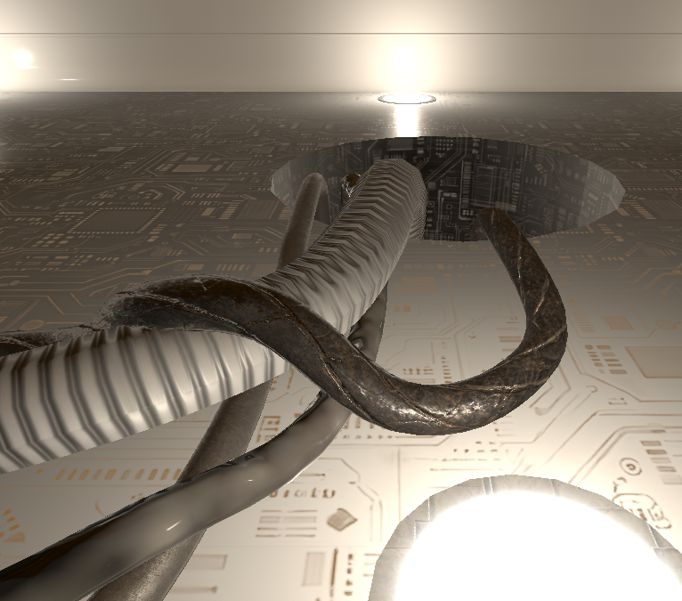
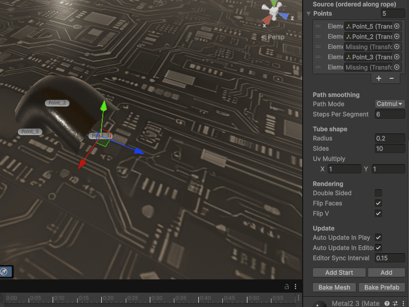

# ProceduralCableSkin

Procedural cable mesh generator for Unity.

This component builds a tube mesh from ordered control points, supports linear and Catmull-Rom interpolation, updates in Edit Mode and Play Mode, and can bake the generated result into a Mesh asset or Prefab.

Tested in **Unity 6000.0.63f1** with the **Built-in Render Pipeline**.

## Features

- Generates a cable mesh from ordered point transforms
- Supports `Linear` and `CatmullRom` path modes
- Adjustable radius, side count, and UV tiling
- Optional double-sided geometry
- Automatic rebuild in Edit Mode and Play Mode
- Inspector buttons for adding points at the start or end
- Bake to Mesh asset
- Bake to Prefab

## Installation

Copy `ProceduralCableSkin.cs` into your Unity project.

## Usage

1. Create or select a GameObject with:
   - `MeshFilter`
   - `MeshRenderer`

2. Add the `ProceduralCableSkin` component.

3. Assign ordered transforms to the `points` array.

4. Adjust:
   - `Path Mode`
   - `Steps Per Segment`
   - `Radius`
   - `Sides`
   - `UV Multiply`

5. Use the inspector buttons:
   - `Add Start`
   - `Add`
   - `Bake Mesh`
   - `Bake Prefab`

## Notes

- The component is marked with `ExecuteAlways`, so it can rebuild in Edit Mode.
- Editor-only functionality is wrapped in `#if UNITY_EDITOR`.
- Baking tools create mesh assets and prefabs directly from the generated cable mesh.

## Tested Environment

- Unity: `6000.0.63f1`
- Render Pipeline: `Built-in`

## File

- `ProceduralCableSkin.cs` — runtime component and custom inspector

## License

MIT
